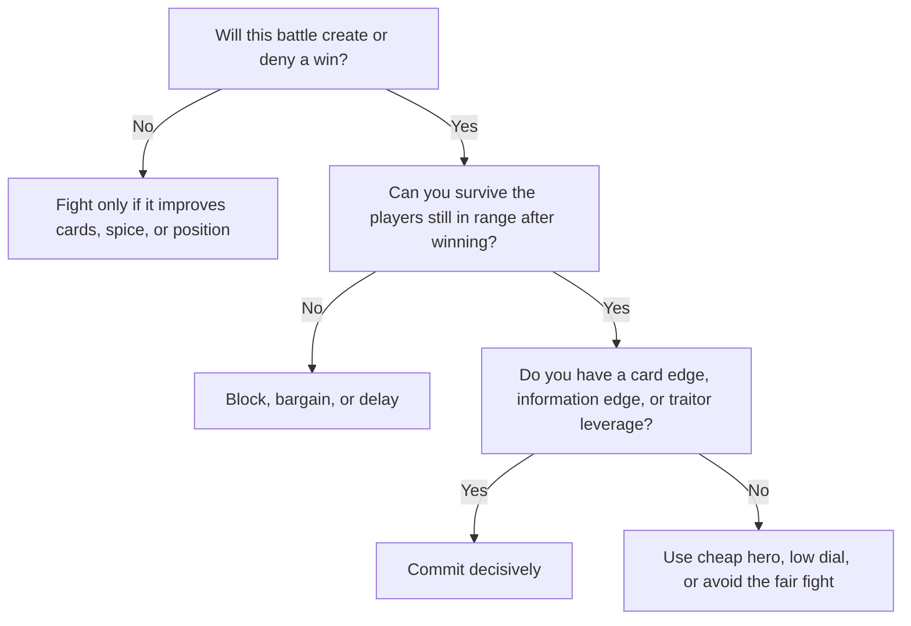

# Combat Heuristics

Treat every battle as a calculation, not a duel.

Before a fight, ask:

1. What happens if I win?
2. What happens if I lose?
3. Can my opponent afford to dial high?
4. Could my leader be a traitor?
5. Is this stronghold or spice blow worth the risk?
6. Am I helping a third player more than myself?

The best battles are ones where even your bad outcome is acceptable.

## Decision tree

This follows from the battle structure: the winner loses only the dialed number, the loser loses everything in the territory, and the winner may keep played cards.

Fair fights are therefore often bad fights.

> Unfair fights are the currency of Dune.
