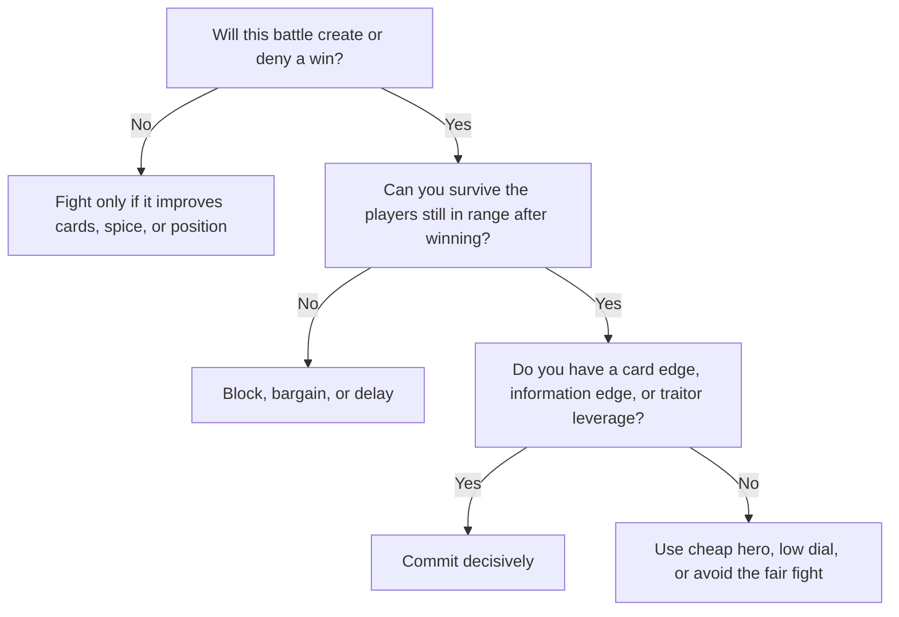

# Diplomacy, Cards, and Combat

## Alliances

Alliances are openly revealed, limited to two players each in the default game, and require **four strongholds** for a joint win.

Allies may secretly discuss strategy, help each other bid, and pay for each other's shipments. They may not enter the same territory except Polar Sink, and they never battle one another.

Non-allied deals and bribes are narrower but powerful. They must be stated aloud and honored, and they may include spice, information, and future actions. They cannot transfer cards, leaders, forces, or faction powers.

That means the strongest diplomacy in Dune is often the sale of **tempo**, not assets.

Good alliance principles:

- Ally with someone whose strengths cover your weaknesses.
- Avoid alliances where one player clearly benefits more.
- Do not ally just because someone is friendly.
- Check whether the alliance can actually win soon.
- Expect the table to coordinate against a strong alliance.

Strong alliance logic includes:

- Atreides plus Bene Gesserit: information and battle control.
- Emperor plus Spacing Guild: economy and mobility pressure.
- Fremen plus Atreides: board presence and information.
- Harkonnen plus Emperor: many cards and enough money to use them.

The exact strength depends on player count, rules, and current table politics.

The best alliance heuristic is:

> Ally to fix your bottleneck.

Atreides often wants money or battle compression. Emperor often wants someone who can threaten combat well enough to monetize imperial funding. Guild often wants a partner who can actually close. Bene Gesserit often wants someone who can create a prediction or Voice-enabled finishing window. Fremen wants equipment or enough partner pressure that their movement becomes lethal rather than merely annoying.

## Negotiation

Dune rewards deals. You can negotiate over spice, information, non-aggression, battle support, stronghold division, turn timing, alliance plans, and who should be stopped.

Useful beginner deals:

- "I will not attack you this turn if you leave this spice blow alone."
- "I will pay you spice to stay out of Arrakeen."
- "Tell me whether that card is a weapon and I will not bid against you."
- "We both lose if that alliance takes a third stronghold. Let's coordinate."

Do not overpromise. A player who makes too many promises loses credibility.

## Treachery cards

Treachery-card management is more important than beginners usually think.

Treachery cards are often decisive. Weapons, defenses, worthless cards, lasguns, shields, and special cards shape which battles are safe.

The rules require players to declare only hand size in bidding, not card type. Battles swing violently because players with matching weapon and defense edges can reverse apparent force disadvantages.

Basic rules:

- Do not enter important fights with no useful cards.
- Maintain several cards if your economy allows it.
- Track who has bought many cards.
- Track what has been played and retained.
- Remember which leaders are safe and which are suspicious.
- Remember that a player with few cards may be bluffing weakness or may genuinely be vulnerable.
- Worthless cards can still be useful in negotiation, bluffing, or hand management.

In other words:

> Dune rewards memory more than raw aggression.

Card knowledge is a major advantage. Atreides is especially strong because they get more information during bidding.

## Combat

Treat every battle as a calculation, not a duel.

Before a fight, ask:

1. What happens if I win?
2. What happens if I lose?
3. Can my opponent afford to dial high?
4. Could my leader be a traitor?
5. Is this stronghold or spice blow worth the risk?
6. Am I helping a third player more than myself?

The best battles are ones where even your bad outcome is acceptable.

## Leader handling

Leader handling follows a simple hierarchy.

Use top leaders when:

- The battle changes the board.
- You are reasonably safe from traitor exposure.
- Your card edge justifies the risk.
- The battle creates or prevents a win.

Use weaker leaders or cheap hero when:

- The battle is exploratory.
- The fight is sacrificial.
- The fight is mainly about card disposal.
- You need to dump worthless cards.
- You want to induce over-defense.

That is not gimmick play. It is correct play when your hand is clogged.

## Traitors

Traitors are one of Dune's core psychological mechanisms.

Revealing a traitor wins the battle immediately, saves the revealer from losses, kills the traitorous leader, and pays spice equal to leader value.

Practical rule:

> Do not put an irreplaceable leader into a low-value fight unless the upside is larger than the downside of instant collapse.

Atreides gets partial mitigation through battle information. Harkonnen increases everyone's paranoia simply by existing.

Watch for suspicious behavior:

- Did someone avoid fighting a specific faction?
- Did someone seem unusually confident against a powerful leader?
- Did someone encourage you to use a particular leader?
- Did someone bid oddly around cards that affect leader safety?

Traitors make combat dangerous. That is the point.

## Combat heuristic

This follows from the battle structure: the winner loses only the dialed number, the loser loses everything in the territory, and the winner may keep played cards.

Fair fights are therefore often bad fights.

> Unfair fights are the currency of Dune.
