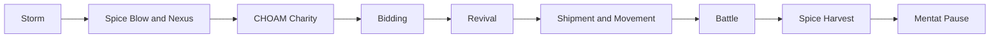

# Strategy Overview

This guide assumes the **Gale Force Nine 2019 / 1979-style Dune ruleset**, treated primarily as a **six-player standard game with default alliance rules**, no expansions, and no house-rule balance patches.

In that baseline, Dune is not mainly a game of winning battles. It is a game of **turn timing, force projection, hand quality, and alliance leverage**. The core arc is simple: amass spice, convert it into weaponry and defenses, then position enough force to move suddenly into key strongholds and defend them.

## Executive summary

The most important high-level rule interaction is this:

> Movement wins the board, but cards decide whether your move sticks.

The storm determines first player for bidding, shipping, and movement. First player gets the tie-break edge in battle, while last movement often gets the best surprise angle because surprise takeovers cannot be countered that turn.

If you remember only one board principle, remember that one.

Your default priorities should be:

- Preserve your mobility anchor if you have one.
- Do not spend yourself spice-poor before you can exploit cards.
- Fight when you have **information or card-quality asymmetry**.
- Choose alliances that solve your actual problem on the current board, not your theoretical problem on turn one.
- Strike for strongholds late enough that the table has limited time to answer.

The Atreides plus Bene Gesserit alliance is a real endgame package because information plus battle control compresses uncertainty. But it is not always the correct alliance. The useful takeaway is not "always ally Atreides and Bene Gesserit"; it is that **information plus battle control is powerful**.

Bene Gesserit is powerful because the faction couples **combat leverage** with the ability to shape when and where the table must care about it. That is especially true in advanced play. In the strict basic game, some of the most famous coexistence-style tricks are not fully online yet.

## Core strategic principles

The basic strategy model is:

1. Build spice.
2. Convert spice into cards.
3. Keep mobile forces within striking distance of strongholds.
4. Go for the win only when you can plausibly hold against everyone still in range.

That implies the most important skill in Dune: **threat accounting**.

Never ask only:

> Can I take the third stronghold?

Ask:

> Who still moves after me, what cards do they plausibly hold, and can they turn my move into a trap?

## Spice is tempo

Spice is not just money. It is **tempo**.

In the basic game:

- Shipping from off-planet costs **1 spice per force into a stronghold**.
- Shipping from off-planet costs **2 spice per force elsewhere**.
- Players with 0 or 1 spice are pulled up to 2 by CHOAM charity.
- Bidding starts from declared hand sizes.
- The basic hand limit is 4 cards.

That means stronghold shipping is the most efficient deployment in the game. Random desert shipments are often a trap unless they produce immediate harvest, denial, or positional threat.

You need spice to:

- Ship troops.
- Revive troops.
- Bid for treachery cards.
- Support battles in advanced combat.
- Threaten strongholds.

If you are poor, everyone can see that your threats are limited. If you are rich, your threat range expands.

## Mobility anchors

Control of **Arrakeen or Carthag** is disproportionately important because any player who begins movement with a force in either city gets ornithopter movement of up to **three adjacent territories**.

The moving group does not need to start in those cities. Merely having a force in one turns on the mobility network. That is why city defense is not just local defense. It is control over your reach.

## Storm and turn order

Storm position is both a hazard and an initiative system.

First player is favored in battle because ties go to the aggressor. Last movement is favored for surprise occupations.

The practical conclusion is that some rounds should be approached as **battle rounds** and some as **movement rounds**.

If you are early in order, think denial, forcing, and tie leverage.

If you are late in order, think opportunistic occupation, surgical blocks, and win-threat geometry.

## Movement into battle

The movement-to-battle conversion is where many new players lose.

The correct question is rarely:

> Who has more troops?

It is usually:

> Who has the better card and information profile?

If your opponent can kill your leader, or if you cannot survive a traitor reveal, raw force count is often a mirage.

## Turn sequence

Strategically, the real inflection points are **Storm**, **Nexus**, **Bidding**, **Shipment and Movement**, and **Battle**. Harvest and Mentat Pause matter, but they usually cash out decisions made earlier in the turn.

## Strongholds are for winning

Strongholds matter because they are victory points. Holding one too early can also make you the table's target.

A common rhythm is:

1. Build spice and cards.
2. Position near strongholds.
3. Wait for opponents to weaken each other.
4. Strike late in the turn sequence.
5. End the turn controlling enough strongholds.

Do not sit proudly on two strongholds too early unless you can defend them. You are announcing yourself as the table's main problem.

## Simple baseline plan

For a beginner, the strongest baseline plan is:

> Get spice, buy cards, avoid bad fights, stay politically useful, and only commit heavily when a stronghold swing can create or prevent a win.

That mindset alone is stronger than treating Dune like Risk.
