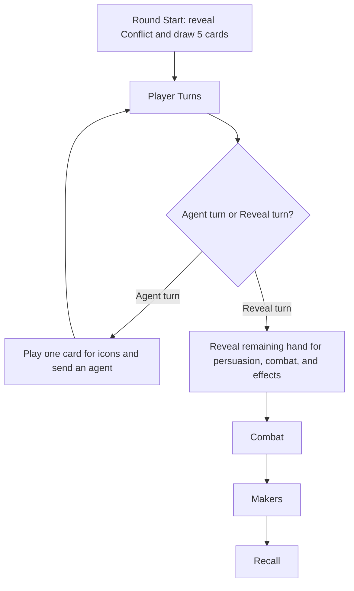

# Turn Sequence

The important strategic consequence is that you usually stop taking agent turns only when your remaining cards are more valuable as reveal than as board access.

Taking a Reveal turn early can be correct, but only if the reveal creates more value than the lost agent action.
