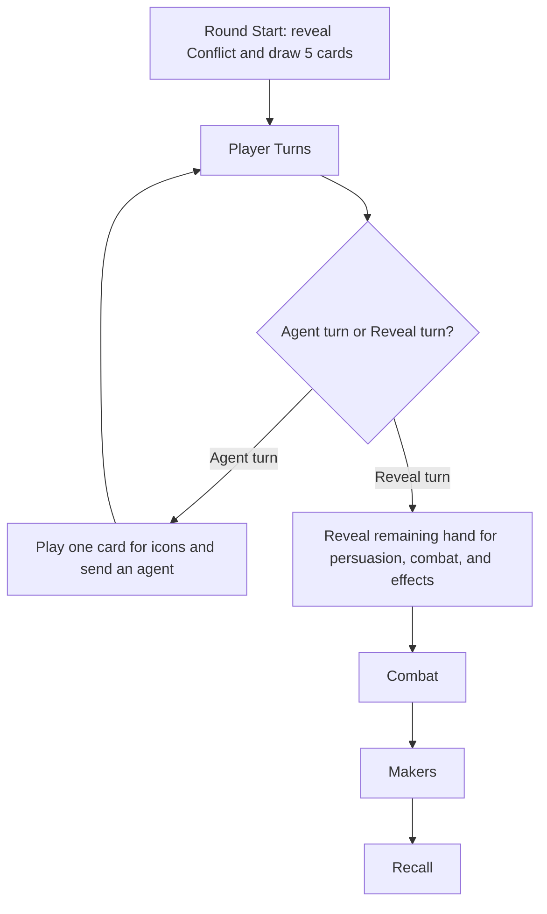

# Turn Sequence

The important strategic consequence is that you usually stop taking [[Dune/Agents and Worker Placement|agent turns]] only when your remaining [[Dune/Deck Building and Card Quality|cards]] are more valuable as reveal than as board access.

Taking a Reveal turn early can be correct, but only if the reveal creates more value than the lost agent action.

Use [[Dune/Game Phase Identification|Dune Imperium Game Phase Identification]] before applying the checklist. The same turn step means different things when players are still buying infrastructure, when they are converting setup into points, and when someone can end the game.

## Round Start

You reveal the conflict and draw five cards.

What to check:

- Is the conflict worth first place, or only a cheap lower reward?
- Does the conflict award a victory point?
- Which opponents are likely to care about it?
- Does my hand support my intended plan, or do I need to pivot?
- Which key spaces are likely to be blocked before I can use them?

Early game:

- Conflict I rewards are usually not worth emptying your garrison for unless they accelerate [[Dune/Swordmaster|Swordmaster]], [[Dune/High Council|High Council]], or a key [[Dune/Faction Tracks and Alliances|influence]] plan.
- Use the hand to identify your first two agent turns and whether you can build toward a third.
- Bludgeon's basic opening example treats early economy actions as setup for Swordmaster, not as points by themselves.

Middle game:

- Conflicts start becoming real conversion points.
- Check whether your hand can support both economy and conflict, or whether you must choose one.
- If you are on a [[Dune/High Council|High Council]] route, start checking whether this hand or the next shuffle can reach [[Dune/The Spice Must Flow|The Spice Must Flow]].

Late game:

- Treat the conflict reveal as a possible game-ending event.
- Count who can reach 10 VP this round before choosing your first action.
- Check whether this is the kind of round where [[Dune/Highliner|Highliner]], a doubled Uprising worm reward, or hidden intrigue can decide the game.

## Agent Turns

On an Agent turn, you play one card for its icons and send one agent to a matching space.

What to check:

- Which card icons are scarce in my hand?
- Which spaces will be gone if I wait?
- Which card do I need to preserve for reveal value?
- Does this action create a point, protect a point, or set up a point?
- If this is a combat space, how many troops do I actually want to deploy?

Early game:

- Prioritize setup actions: [[Dune/Solari|solari]] for [[Dune/Swordmaster|Swordmaster]], [[Dune/Water|water]]/[[Dune/Spice|spice]] access, faction access, card draw, and deck improvement.
- Avoid spending troops just because a combat space is available.
- In [[Dune/Rise of Ix|Ix]] games, watch whether the Interstellar Shipping or Smuggling lane is contested; pivot to water or another setup line if the solari race is blocked.

Middle game:

- Start converting setup into points.
- Board blocking matters more because players are now racing faction thresholds, conflicts, and high-value cards.
- Preserve rare icons when possible. A strong reveal is not useful if the agent turn spends the only icon that reaches your scoring space.

Late game:

- Every agent action should have a concrete scoring purpose.
- Denial can be as valuable as scoring if it stops another player from ending the game.
- Before placing troops, ask whether the conflict is worth the troops after opponents' remaining reveals and combat intrigue are counted.

## Reveal Turn

On your Reveal turn, you reveal the remaining cards for persuasion, combat, and reveal effects.

What to check:

- Can I buy a card that improves my next shuffle?
- Can I buy [[Dune/The Spice Must Flow|The Spice Must Flow]]?
- Is my reveal combat enough to change conflict placement?
- Would revealing now abandon a useful agent action?
- Am I revealing before opponents who can still outbid me in combat?

Early game:

- Buying one good access card can matter more than buying several average cards.
- Revealing early is usually costly unless it secures a key card or avoids wasting an agent.
- Prioritize faction-access cards such as Power Play-style effects when they fit your plan; access creates [[Dune/Faction Tracks and Alliances|influence]], and influence creates points.

Middle game:

- Watch for deck direction. A reveal should either improve card quality, add scoring access, or support conflict.
- If [[Dune/High Council|High Council]] is online, calculate [[Dune/The Spice Must Flow|The Spice Must Flow]] thresholds every round.
- Do not buy generic bulk. Bludgeon's card advice is plan-first: influence/persuasion cards for point buying, swords and troop effects for conflict lines.

Late game:

- [[Dune/Persuasion|Persuasion]] is mostly about points, not future engine.
- A late reveal that cannot score should usually deny, win combat, or set up an unavoidable next-round point.
- If you can buy [[Dune/The Spice Must Flow|The Spice Must Flow]], assume that is the default unless a different action scores more or blocks the winner.

## Combat

Combat resolves after all players have revealed.

What to check:

- Who still has [[Dune/Intrigue Cards|combat intrigue cards]]?
- Did anyone reveal enough swords to change the auction?
- Is first place necessary, or is second/third enough?
- Will spending combat intrigue here expose me later?
- In [[Dune/Uprising|Uprising]], can worms double the reward?

Early game:

- Treat combat as resource acquisition unless the reward directly affects tempo.
- Do not overpay for a small reward.

Middle game:

- Point conflicts and alliance pressure become more important.
- Force opponents to spend troops inefficiently when possible.
- Track reveal swords before committing combat intrigue. A player who has not revealed yet is still bidding.

Late game:

- Combat is often a direct win condition.
- Count hidden combat and intrigue risk before assuming a placement is safe.
- Conflict III starts around round 7. If a future Conflict III is likely to matter, prepare [[Dune/Troops|troops]] and [[Dune/Spice|spice]] before the turn where everyone sees the reward.
- [[Dune/Highliner|Highliner]] often decides large conflicts, so six spice is a tactical threshold, not just an economy stockpile.

## Makers

Maker spaces accumulate [[Dune/Spice|spice]].

What to check:

- Did a spice space become large enough to justify [[Dune/Water|water]] or action cost?
- Does taking spice now delay a point?
- Can an opponent use the spice better than I can?

Early game:

- [[Dune/Spice|Spice]] can open strong economy lines, but it still needs a conversion plan.

Middle game:

- Spice should turn into [[Dune/Highliner|Highliner]]-style conflict pressure, faction movement, tech, or [[Dune/The Spice Must Flow|The Spice Must Flow]] support depending on the module.

Late game:

- Spice that cannot become points is usually less important than denial or direct scoring.

## Recall

Agents return, the first-player marker passes, and the next round begins.

What to check:

- What did each player reveal about their plan?
- Who is one action away from a point?
- Which spaces are likely to be contested next round?
- What does my next shuffle look like?
- Did anyone gain enough resources to force a game-ending line?

Early game:

- Track who is closest to [[Dune/Swordmaster|Swordmaster]], [[Dune/High Council|High Council]], or faction access.

Middle game:

- Track alliance races and conflict readiness.

Late game:

- Recount all visible and likely hidden points before the next Round Start.

## Related

- [[Dune/Game Phase Identification|Game Phase Identification]]
- [[Dune/Agents and Worker Placement|Agents and Worker Placement]]
- [[Dune/Deck Building and Card Quality|Deck Building and Card Quality]]
- [[Dune/Combat and Conflicts|Combat and Conflicts]]
- [[Dune/Late Game Checklist|Late Game Checklist]]
- [[Dune/Swordmaster|Swordmaster]]
- [[Dune/The Spice Must Flow|The Spice Must Flow]]
