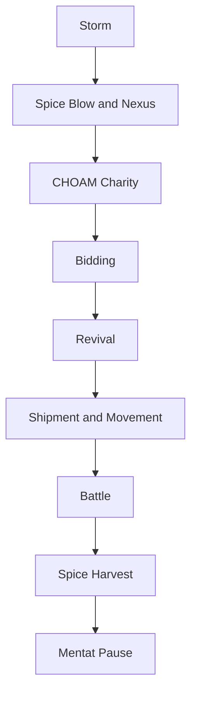

# Turn Sequence

Strategically, the real inflection points are **Storm**, **Nexus**, **Bidding**, **Shipment and Movement**, and **Battle**.

Harvest and Mentat Pause matter, but they usually cash out decisions made earlier in the turn.
